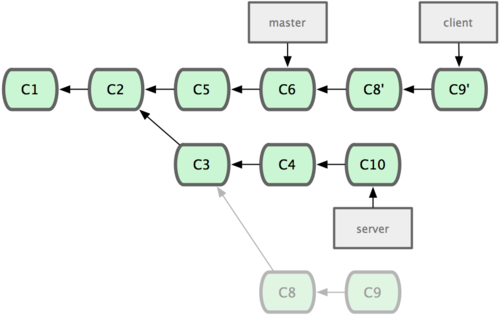

!SLIDE subsection
# Auffrischung #

!SLIDE bullets smaller
# Commit #

* Jeder Commit hat einen eindeutigen Hash
* bestehen aus: Autor, Committer, Autor-Datum, Commit-Datum, Commit-Message, Snapshot (Tree)
* Ein Commit hat 0,1 oder mehrere Parents (Eltern)
* Merge-Commit: Commit mit mehreren Parents

!SLIDE bullets smaller
# Branch #

* Referenz auf das neuste Commit eines Entwicklungsstrangs
* aktuell ausgecheckter Branch rückt beim Commit vorwärts
* HEAD ist eine Referenz auf den aktuell ausgecheckten Branch

!SLIDE subsection
# Introspection & Manipulation #

!SLIDE center

!SLIDE bullets
# Git Graph I #
* Netz aus zeitlich verknüpften Knoten (Commits)
* Git verstehen heisst den Graphen verstehen und verändern können

!SLIDE bullets
# Git Graph II #
* Sämtliche Operationen _(commit, branch, merge, rebase, cherry-pick)_ sind Graph-Manipulationen

!SLIDE bullets
# Git Graph III #
* Knoten erzeugen (Commit)
* Äste erzeugen (Branch)
* Äste zusammenfügen (Merge)
* Knoten auf Äste kopieren (Cherry-Pick)
* Äste verschieben (Rebase)

!SLIDE subsection
# Befehle #

!SLIDE bullets smaller
# git log #

* Anzeigen der Commits und deren Verknüpfung (Graph)
* Filtern von Commits
* Anzeigen der Änderungen der einzelnen Commits
* Das Tool zur Inspektion des Graphs

!SLIDE bullets
# git diff #

* Vergleichen von zwei Snapshots
* History ist nicht relevant. Es werden direkt Commits oder Files verglichen.

!SLIDE bullets
# git cherry-pick #

* Commits über mehrere Branches verwenden
* Bugfix auf mehrere Releases anwenden
* Nur einen Teil eines Branches integrieren
* Commits an einen anderen Ort verschieben

!SLIDE bullets smaller
# git merge #

* Zwei Stränge miteinander verbinden
* Ein Merge-Commit hat mehr als 1 Parent.
* Ein Merge kann rückgänig gemacht werden, wenn man das Merge-Commit entfernt

!SLIDE bullets smaller
# git merge --ff-only #

* Merge von einem nicht abgezweiten Branch => Fast Forward
* Fast Forward Merge => kein Merge-Commit
* Fast Forward Merge => Branch in der History nicht mehr sichtbar

!SLIDE center

## git merge --no-ff topic/feature ##

## git merge --ff-only topic/feature ##

!SLIDE bullets
# Rebase #

* Strang anhand einer Basis neu "ausrichten"
* Es werden neue Commits erstellt
* Folgende Informationen der Commits ändern: _Parent, Committer, Committer-Datum und der Snapshot_

!SLIDE
# Unterschied Merge | Rebase#

!SLIDE center smaller
# Ausgangslage #

# Merge #

!SLIDE center smaller
# Ausgangslage #

# Rebase #

!SLIDE bullets
# Rebase II #

* Commits "verschieben"

!SLIDE center
# Ausgangslage #

!SLIDE center
## git rebase --onto master server client ##

!SLIDE center
## git checkout master && git merge client ##

!SLIDE center
## git rebase master server ##

!SLIDE center
## git checkout master && git merge server ##

!SLIDE smaller
# Rebase | Merge #

* NICHT rebasen mit veröffentlichten Commits
* NICHT rebasen bei grossen Branches
* Merge ist in der History sichtbar (wenn nicht FF)
* Rebase simuliert lineare History
* Rebase --onto um Commits zu verschieben

!SLIDE smaller
# Interactive Rebase #

* Reihenfolge der Commits ändern
* Commit-Message ändern
* Commits verschmelzen
* Commits entfernen
* Änderungen eines Commits bearbeiten
