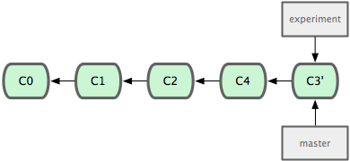

!SLIDE bullets
# Cherry Picking #

* Commits über mehrere Branches verwenden
* Bugfix auf mehrere Releases anwenden
* Nur einen Teil eines Branches integrieren

!SLIDE commandline incremental
    $ git cherry-pick 6018dbfa70
    Finished one cherry-pick.
    [test e144b96] Add unit tests for index manipulation
     Author: Vicent Marti <tanoku@gmail.com>
     4 files changed, 209 insertions(+), 0 deletions(-)

!SLIDE bullets smaller
# Merging #

* Normalerweise erstellt Git bei einem Merge ein Merge-Commit
* Ein Merge-Commit hat mehr als 1 Parent.
* Ein Merge kann rückgänig gemacht werden, wenn man das Merge-Commit
  entfernt

!SLIDE bullets smaller
# Merging: Fast Forward #

* Merge von einem nicht abgezweiten Branch => Fast Forward
* Fast Forward Merge => kein Merge-Commit
* Fast Forward Merge => Branch in der History nicht mehr sichtbar

!SLIDE center

## git merge --no-ff topic/feature ##

## git merge --ff-only topic/feature ##

!SLIDE
# Rebase #

!SLIDE center
# Ausgangslage #

!SLIDE center
# Merge #

!SLIDE center
# Rebase #

!SLIDE center
# Merge (FastForward) #

!SLIDE center
# Rebase II #

!SLIDE center
# Ausgangslage #

!SLIDE center
## git rebase --onto master server client ##

!SLIDE center
## git checkout master && git merge client ##

!SLIDE center
## git rebase master server ##

!SLIDE center
## git checkout master && git merge server ##

!SLIDE smaller
# Rebase | Merge #

* NICHT rebasen mit veröffentlichten Commits
* NICHT rebasen bei grossen Branches
* Merge ist in der History sichtbar (wenn nicht FF)
* Rebase simuliert lineare History
* Rebase --onto um Commits zu verschieben
